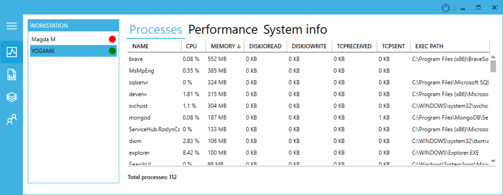
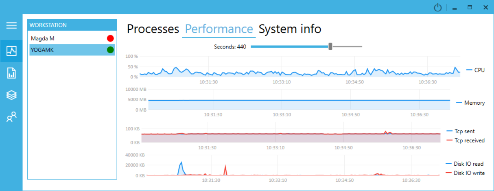
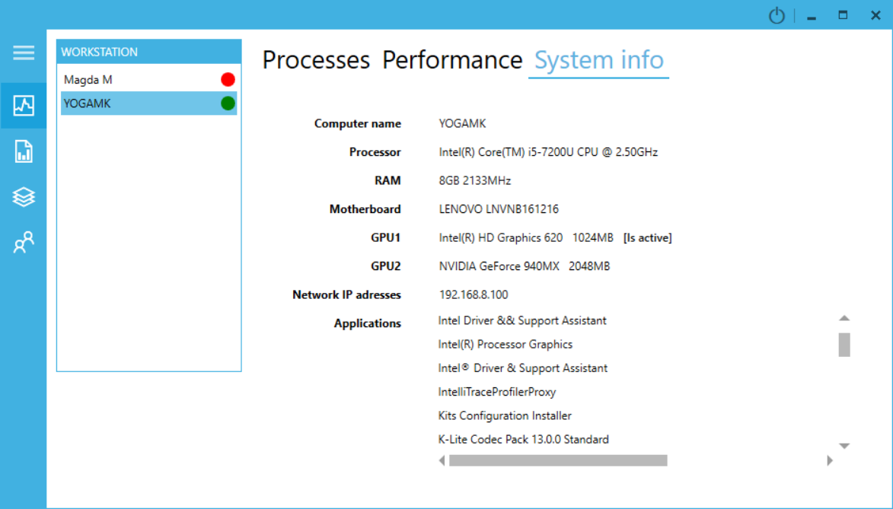
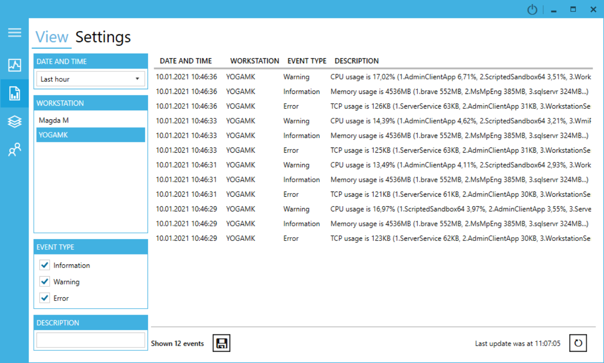
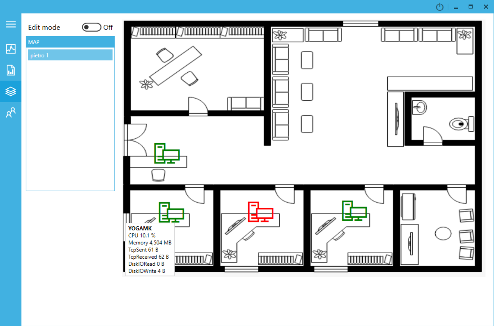
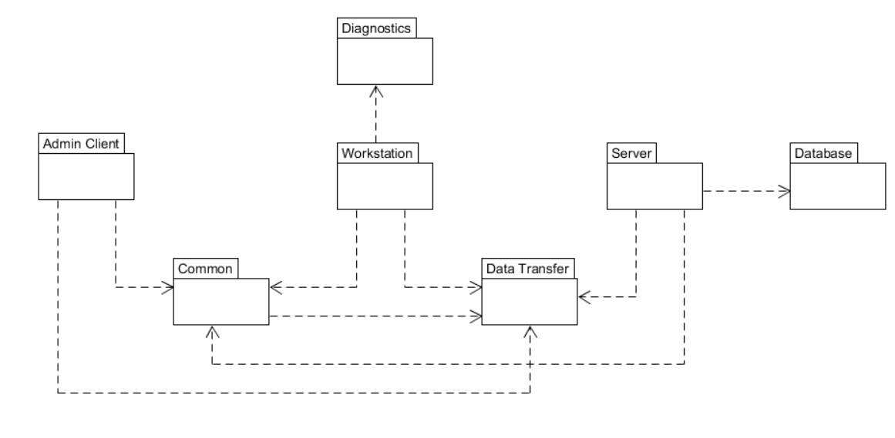

# workstations-monitor
Gathers and visualizes data from workstations in real time. App created with C#, WPF and MongoDB.

## Table of Contents
- [Introduction](#introduction)
- [Features](#features)
- [Technologies](#technologies)
- [Architecture](#architecture)
- [Launch](#launch)
- [Summary](#summary)

## Introduction
It had been created due to thesis (for engineer's degree) which is titled 'A system supporting the work of the IT department in a organization'. In short project consists of three applications:
- service at **workstations** sends periodically to the server a current running processes state
- **server** persists and processes that data.
- **desktop app** logged into server visualizes gathered informations in a pleasant way. 

## Features
- Current running processes

- Total performance

- System information

- Events

- Maps

## Technologies
The project was originally written in .NET Framework 4.6.1. It's 2022 already so I took the trouble to upgrade it to **.NET 6.0**. Other technologies worth mentioning are listed below
- MongoDB
- AutoMapper
- WPF
- Dependency injection
- NUnit

## Architecture

The diagram of components and their dependencies is shown below

## Launch
How to run a project? Does a project has minimum hardware requirements?

## Summary
what did I learn, pros and cons
